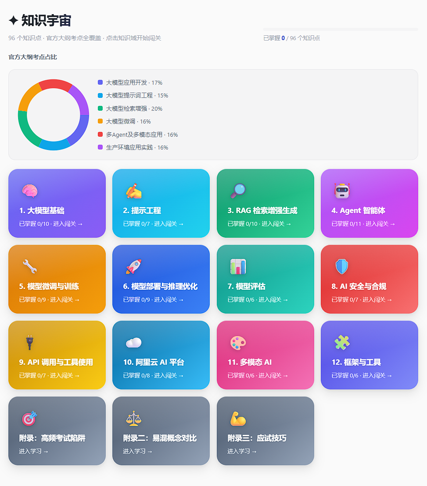
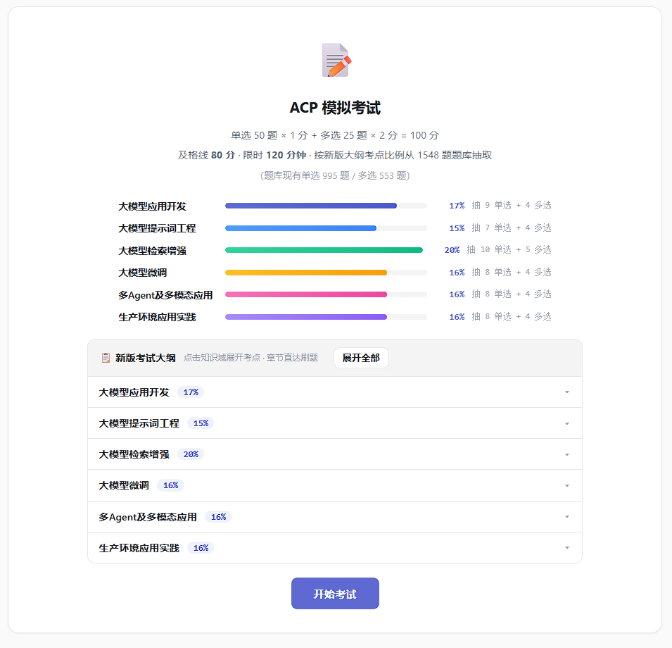
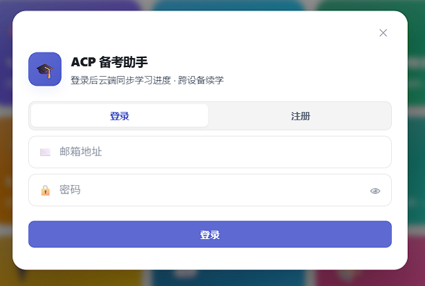
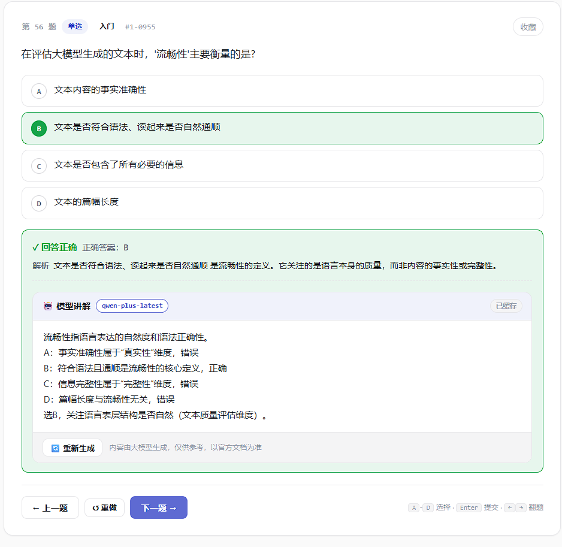

# 🎓 ACP 备考助手

> 阿里云大模型高级工程师认证（Alibaba Cloud ACP – Large Model）一站式备考平台：**知识学习 · 章节刷题 · 标准模考 · AI 答疑 · 跨设备同步**。
>
> 纯前端静态站点，零构建依赖，双击 `index.html` 或部署到任意静态托管即可使用。

<p align="center">
  
  
  
  
</p>

---

## 目录

- [功能特性](#-功能特性)
- [快速开始](#-快速开始)
- [部署](#-部署)
- [可选配置](#-可选配置)
- [项目结构](#-项目结构)
- [技术栈](#-技术栈)
- [数据与构建](#-数据与构建)
- [贡献指南](#-贡献指南)
- [致谢](#-致谢)
- [许可证](#-许可证)
- [免责声明](#-免责声明)

---

## ✨ 功能特性

### 学习板块

- **知识宇宙**：12 章教材式知识点阅读，自研 Markdown 渲染器支持 5 种内置图表（流程图、条形图、环形图、注意力热力图、矩阵分解图）和教材级信息块（学习目标、现实场景、工作原理、考试重点、自测题等）。
- **学习进度**：逐知识点标记掌握状态，环形进度图实时展示章节完成度。
- **深度学习 / 考前速记双模式**：考前速记模式自动折叠深入讲解，只保留考试要点与常见误区。

### 刷题板块

- **章节练习**：12 章分章刷题，单选 / 多选，支持全部、未答、错题、收藏四种筛选。
- **模拟考试**：75 题标准卷（50 单选 × 1 分 + 25 多选 × 2 分 = 100 分，及格线 80），按官方大纲六大知识域比例（应用开发 17% / 提示词 15% / RAG 20% / 微调 16% / 多 Agent 及多模态 16% / 生产环境 16%）分层抽题，120 分钟计时，交卷后逐题回顾与薄弱章节分析。
- **错题本 / 收藏夹**：错题自动收集、重点题随时标记，支持一键重练。
- **全局搜索**：题干关键词实时检索并高亮跳转。
- **键盘操作**：`A`–`G` 选题、`Enter` 提交、方向键翻题，支持单题 / 列表双视图与随机顺序。

### 可选增强

- **AI 答疑**：答题后调用任意 OpenAI 兼容大模型（阿里云百炼、DeepSeek、智谱、硅基流动等）逐项讲解，SSE 流式输出，结果本地缓存，API Key 仅存本机。
- **跨设备同步**：邮箱注册登录后，进度、错题、收藏、成绩、续做位置通过 Supabase 实时同步，冲突按"计数取大、时间戳取新、收藏取并集"自动合并。

---

## 🚀 快速开始

### 方式一：直接打开

双击 `index.html` 即可在浏览器中使用。所有题库与知识点通过 `<script>` 标签加载，无需安装任何依赖。

### 方式二：本地服务器（推荐）

部分浏览器对 `file://` 协议下的 `fetch` / 本地存储有限制，建议启动一个静态服务器：

```bash
# Python 3（自带，无需安装）
python -m http.server 8080

# 或 Node.js
npx serve .
```

然后访问 <http://localhost:8080>。

---

## 📦 部署

本项目是纯静态站点，可部署到 GitHub Pages、Cloudflare Pages、Vercel、Netlify、Nginx 等任意静态托管平台。

### GitHub Pages

1. Fork 本仓库；
2. 在仓库 Settings → Pages 中选择 `main` 分支根目录作为 Source；
3. 等待 Actions 构建完成即可通过 `https://<your-name>.github.io/<repo>/` 访问。

仓库根目录提供了一个 Windows 一键推送脚本：

```powershell
.\一键更新.bat
```

### 其他平台

直接将整个目录上传到静态托管服务即可，无需构建步骤。

---

## 🔧 可选配置

以下功能**均为可选**，未配置时应用以纯本地模式完整运行（学习、刷题、模考均可用）。

### AI 答疑

在侧边栏「🤖 AI 设置」中填入任意 OpenAI 兼容服务的：

- **API Base URL**：例如 `https://dashscope.aliyuncs.com/compatible-mode/v1`（阿里云百炼）
- **API Key**：在对应服务商控制台申请
- **模型名**：例如 `qwen-plus`、`deepseek-chat`、`glm-4-flash` 等

API Key 仅保存在浏览器 `localStorage`（键名 `acp_ai_config`），浏览器直连服务商接口，不经过任何第三方服务器。

### 云端同步（Supabase）

1. 在 [Supabase](https://supabase.com) 创建项目；
2. 在 SQL Editor 中执行 [`supabase/schema.sql`](supabase/schema.sql)（建表 + 行级安全策略）；
3. Authentication → Providers → Email 开启；如需注册后自动登录，关闭 Confirm email；
4. Authentication → URL Configuration 添加站点地址；
5. 把 Project URL 与 `anon` public key 填入 [`config/supabase.js`](config/supabase.js)。

> **安全提示**：前端只能使用 `anon` public key，并依靠 RLS（Row Level Security）保证用户只能访问自己的数据。`service_role` 密钥严禁进入前端代码或仓库。

---

## 📁 项目结构

```
acp/
├── index.html               # 入口 HTML（学习 / 刷题二选一落地页）
├── style.css                # 全局样式与教材设计系统
│
├── data/                    # 运行时加载的数据
│   ├── knowledge.js         # 知识点（window.KNOWLEDGE_MD，由脚本生成）
│   ├── quiz_categorized.js  # 题库（完整版）
│   └── quiz_categorized.min.js
│
├── js/                      # 前端模块（IIFE，挂载到 window.ACP）
│   ├── acp.js               # 全局常量（考试大纲、章节、状态）
│   ├── utils.js             # 工具函数
│   ├── store.js             # localStorage 存储层
│   ├── data.js              # 题库构建与统计
│   ├── study.js             # 知识点阅读器 + Markdown 渲染 + 教材组件
│   ├── chapter.js           # 章节练习
│   ├── exam.js              # 模拟考试引擎（按大纲比例抽题）
│   ├── dashboard.js         # 学习总览
│   ├── search.js            # 全局搜索
│   ├── sidebar.js           # 侧边栏
│   ├── ai.js                # AI 答疑（OpenAI 兼容 + 流式）
│   ├── sync.js              # Supabase 登录与云同步
│   └── app.js               # 启动入口、主题、键盘事件
│
├── config/
│   ├── supabase.js          # Supabase 公开配置
│   └── verify_config.example.json
├── supabase/schema.sql      # 数据库表结构 + RLS 策略
│
├── scripts/                 # 数据处理与测试脚本（Python / Node）
│   ├── build_knowledge.py   # 把知识点 Markdown 打包为 knowledge.js
│   ├── classify_questions.py
│   ├── compress_bank.py
│   ├── verify_answers.py
│   └── test_*.js            # 各模块冒烟测试
│
├── docs/                    # 知识点源文档与校验报告
│   └── ACP高频知识点总结.md
└── github项目展示截图/       # README 截图
```

---

## 🛠 技术栈

| 层 | 技术 | 说明 |
|----|------|------|
| 前端 | 原生 HTML / CSS / JavaScript（ES6+） | 无框架、无打包工具，IIFE 模块化挂载到 `window.ACP` |
| 持久化 | `localStorage` | 进度、错题、收藏、成绩、AI 配置本地保存 |
| 图表 | 原生 SVG / CSS | 5 种内置图表，零第三方依赖 |
| 认证 / 云同步 | Supabase Auth + PostgreSQL + RLS | 可选；邮箱登录，行级安全隔离用户数据 |
| AI 答疑 | OpenAI 兼容接口 | 浏览器直连，SSE 流式输出，多服务商可切换 |
| 数据脚本 | Python 3 | 题库合并、分类、压缩、答案多模型校验 |

---

## 📊 数据与构建

### 知识点

知识点源文档为 [`docs/ACP高频知识点总结.md`](docs/ACP高频知识点总结.md)，由 [`scripts/build_knowledge.py`](scripts/build_knowledge.py) 打包为 `data/knowledge.js`：

```bash
python scripts/build_knowledge.py
```

修改知识点后**必须重新运行此脚本**，否则前端加载的仍是旧版本。

### 题库

- 共 **1652 题**，覆盖 12 章；
- 题目按章节存放在 `data/quiz_categorized.js`；
- 压缩版 `quiz_categorized.min.js` 用于生产环境，体积更小。

### 考试大纲

官方大纲六大知识域与抽题配额定义在 [`js/acp.js`](js/acp.js) 的 `ACP.EXAM_DOMAINS`，修改大纲比例会自动影响模拟考试抽题与知识宇宙环形图。

---

## 🤝 贡献指南

欢迎 Issue 和 Pull Request！

### 报告问题

提 Issue 时请尽量包含：

- 浏览器与操作系统版本；
- 问题描述与复现步骤；
- 控制台报错截图（如有）；
- 题目内容截图（如为题目本身的问题）。

### 贡献内容

1. Fork 本仓库并创建特性分支：`git checkout -b feature/your-feature`；
2. 知识点改动请编辑 `docs/ACP高频知识点总结.md`，然后运行 `python scripts/build_knowledge.py`；
3. 题库改动请说明题目来源与答案依据；
4. 提交前请运行相关冒烟测试：`node scripts/test_*.js`；
5. 确保代码不包含任何 API Key、`.env`、`service_role` 等敏感信息；
6. 提交 PR，并清晰描述改动内容与动机。

### 代码风格

- 前端使用原生 JavaScript，不引入新的构建工具或框架；
- 缩进 4 空格，字符串优先使用单引号；
- 模块通过 `(function(ACP){ ... })(window.ACP)` IIFE 封装，通过 `ACP.xxx = ...` 显式导出；
- Python 脚本兼容 Python 3.9+。

---

## 🙏 致谢

- 知识点与部分教材内容参考了阿里云官方开源教程 [aliyun/aliyun_acp_learning](https://github.com/AlibabaCloudDocs/aliyun_acp_learning)（Apache License 2.0），该仓库作为写作参考置于本地目录 `aliyun_acp_learning/`，未包含在本仓库中；
- 题目来源于公开 ACP 备考资料，答案经多模型交叉校验与人工核对，仅供学习参考；
- 感谢所有提出反馈与修正的同学。

---

## 📄 许可证

本项目代码以 MIT License 发布（如需在仓库中正式附带协议文本，可在 GitHub 创建仓库时选择 MIT License 自动生成 LICENSE 文件）。

题库、知识点文本与截图**仅供个人学习交流使用**，不得用于商业用途；考试题目的相关版权归阿里云及原作者所有。

---

## ⚠️ 免责声明

- 本项目为社区学习项目，与阿里云官方无任何关联；
- 题目与解析不保证 100% 正确，正式考试请以阿里云官方文档与最新考试大纲为准；
- AI 答疑功能由第三方大模型提供，回答内容不代表本项目观点，关键知识点请交叉验证；
- 使用 Supabase 或任何云服务时，请自行评估数据安全与合规风险。
